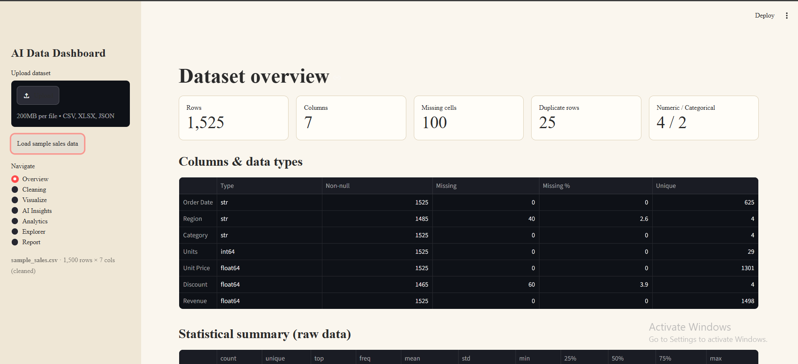
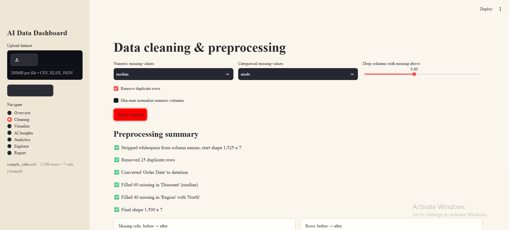
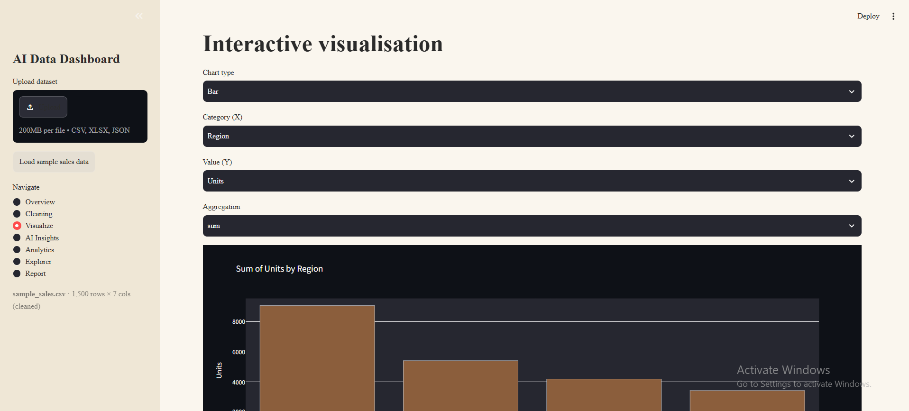
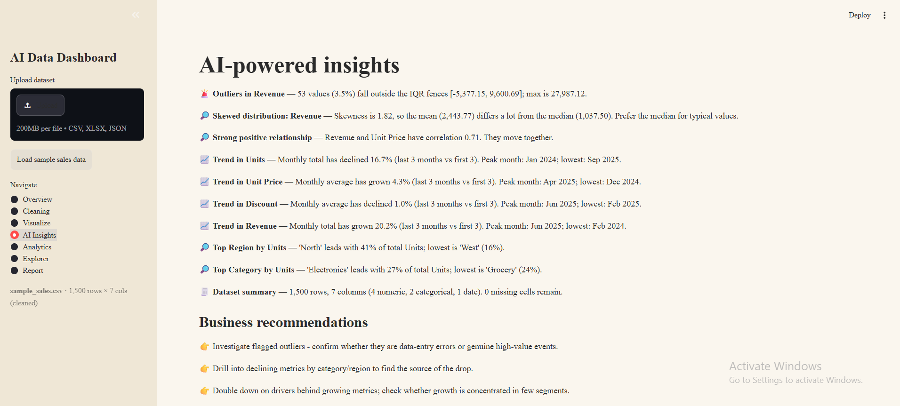
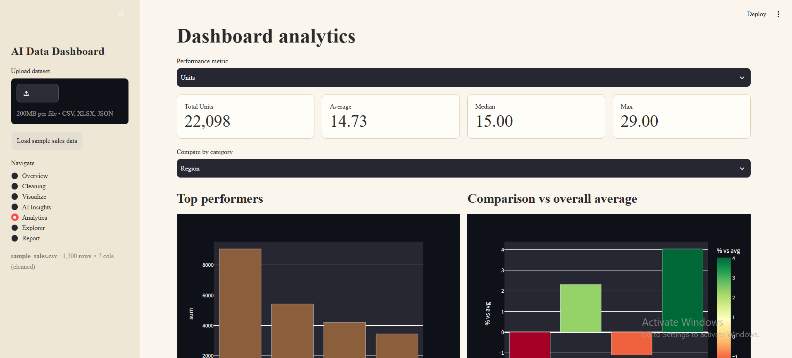
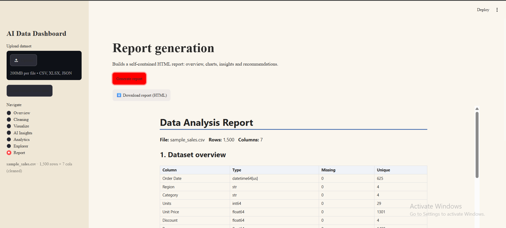

# AI Data Analysis Dashboard

Upload a dataset and get cleaning, interactive charts, automatic insights, analytics and a downloadable report.

## Features
- Upload CSV / XLSX / JSON with validation (type, size, empty file, parse errors)
- Cleaning: duplicates, missing values (median/mean/mode), sparse-column drop, date/number auto-conversion, normalisation, before/after log
- Overview: shape, dtypes, missing summary, statistical summary
- Charts: bar, line, pie, histogram, scatter, correlation heatmap (dynamic column selection)
- AI insights: rule-based engine (trends, outliers via IQR, skew, correlations, category concentration, imbalance) + business recommendations; optional LLM narrative
- Analytics: KPI cards, top performers, comparison vs average, monthly growth/MoM, distribution stats
- Explorer: text search, per-column filters, custom pandas query, CSV export
- Report: self-contained HTML (print to PDF)

## Run locally
```bash
pip install -r requirements.txt
streamlit run app.py
```
Optional LLM summary: `export ANTHROPIC_API_KEY=...` (only summary statistics are sent).

## Deploy (free)
Push to GitHub -> share.streamlit.io -> New app -> `app.py`. Add `ANTHROPIC_API_KEY` under Secrets if desired.

## Structure
- `core.py` – loading/validation, cleaning, insight engine, report builder
- `app.py` – Streamlit UI
- `sample_sales.csv` – demo data with deliberate missing values, duplicates and outliers

## Screenshots






